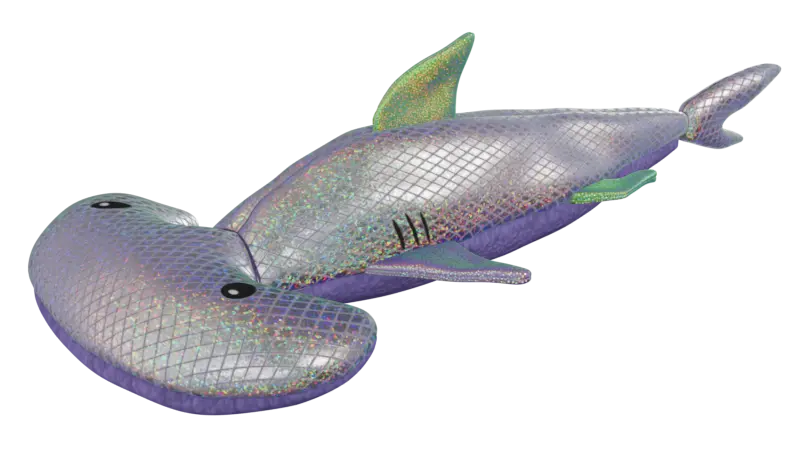
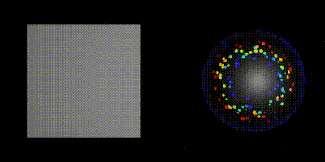
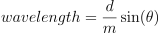

# Year of Tech Art - March: Disco Hammerhead (Blender)

  

As with previous YoTA models, this was made with [Blender](https://www.blender.org/) and textured with [Krita](https://krita.org/). Similar to my [pumpkin toy](https://github.com/heyoeyo/YoTA_01_Pumpkin_Toy), this work was based off of a cat toy. Apparently I'm working towards becoming a cat toy specialist. 

I had been mesmerized by this thing for a few weeks, so it was an easy pick for trying to render. The 'skin' of the hammerhead has extremely interesting material properties. It appears to be a kind of [holographic foil](https://www.foilco.com/holographic-foil/#:~:text=What%20is%20Holographic%20Foil%3F,Holographic%20hot%20stamping%20foil%20range) with a small random dot pattern that glitters in rainbow colors as you move around it. The underlying hatching/diamond pattern is matte by comparison, which provides a nice contrast. So the goal this month was to focus on replicating the material properties (a.k.a. figuring out shaders!), rather than worrying too much about the geometry, which is fairly simple.

  

Overall, I'm actually a bit disappointed with my result. When moving around the viewport in Blender, the holofoil effect is kinda-sorta close to correct, but something is clearly missing. In renders, the effect is even less impressive, since the glittery effect seems to be washed out. I assume this is down to a combination of me not understanding/modeling the physical (i.e. real-life) effect well enough, along with also implementing it incorrectly within Blender. I think I might try to come back to this, or something similar (rendering [Opal](https://en.wikipedia.org/wiki/Opal#/media/File:Jupiter_20_Opal_and_Diamond_Pendant.jpg)?) in the future.

## Notes for future reference

### UV distortion when using the multiresolution modifier

The multiresolution modifier lets you subdivide a low polygon model, then sculpt on the resulting high density mesh without losing the underlying low-poly model. After sculpting, you can then [bake the hi-res details](https://www.youtube.com/watch?v=MGioVd8TtPQ) into a normal map that can be applied to the low-poly mesh to mimic the surface details of the hi-res mesh. Pretty awesome trick!

Unfortunately, it turns out that if you start with a *very* low poly mesh, the process of subdividing can result in some wonky topology. This may or may not matter for sculpting, but in my case, it caused a bit of a headache with the UV map of the model, as some areas got very stretched due to weird curvature introduced at higher subdivisions. I couldn't find a way to introduce more structure to the low-poly mesh without seriously messing up the hi-res sculpt. Maybe there is a way to retroactively fix this problem, but otherwise, it's worth keeping in mind for future use: it's a good idea to check for UV distortion *before* doing any sculpting work at higher resolutions!

### Diffraction coloring

The shader mimicking the holographic effect is modeled as if the surface behaves like a [diffraction grating](https://en.wikipedia.org/wiki/Diffraction_grating). This results in a rainbow pattern with the same ordering (i.e. blue at shallow viewing angles, transitioning to red at steeper angles) as seen on the real-life toy. Within the shader, the coloring is handled as an emission component, this is likely wrong, but it was the only way I could find to get vivid coloring like the real life toy.

The formula used for determining the reflected wavelength is:

  

Where `d` is the 'diffraction grating spacing' , `m` is the 'diffraction order' and `θ` is the viewing angle. The grating spacing can be adjusted to change the spread of the colors. The diffraction order must be an integer value of 1, 2, 3 etc. Technically the result from every order should be added together, but in practice it seemed fine to only use the first 1-3, since higher orders correspond to light bouncing at very steep angles.

The viewing angle was calculated using the surface normal of the model and the 'incoming' vector from Blender's [geometry shader node](https://docs.blender.org/manual/en/latest/render/shader_nodes/input/geometry.html) (not to be confused with [geometry nodes](https://docs.blender.org/manual/en/latest/modeling/geometry_nodes/index.html) which are separate from shaders!). In reality, while the viewing angle does affect the result, it's clear that the position/angle of light sources also matters. For example, there is no holographic glittering on the shadowed side of the toy (in a darker room). This was hard to account for within Blender, and it's clearly something missing from my implementation.

### Noise/Effect texturing

The bottom of the shark has a fabric similar to something called [Bouclé](https://en.wikipedia.org/wiki/Boucl%C3%A9) (boo-clay). Since I was more focused on the shader work this time, I didn't want to manually try to re-create the texture appearance in Krita, so I ended up grabbing a random [bouclé image](https://www.istockphoto.com/photo/denim-blue-boucle-curly-knit-fleece-fabric-texture-gm1337933017-418683048) and stitching stuff together to get the effect for the final model. This worked out quite nicely I think, and was a lot faster than what I've done in the past.

Similarly, I needed several noise/pattern textures to approximate the look of the shark skin. Mostly these were generated using Blender's built-in noise shader nodes (and [baking them out](https://www.youtube.com/watch?v=LLQFopN--LY)), but I also needed a dot pattern for the holofoil effect, which I got by modifying an implementation I found on [Jason Davies website](https://www.jasondavies.com/poisson-disc/).

The moral of the story here is that having quick/easy access to a good set of textures and procedural patterns is invaluable for quickly creating and iterating on shaders. It might be worth creating a go-to list of sources for these sorts of things!